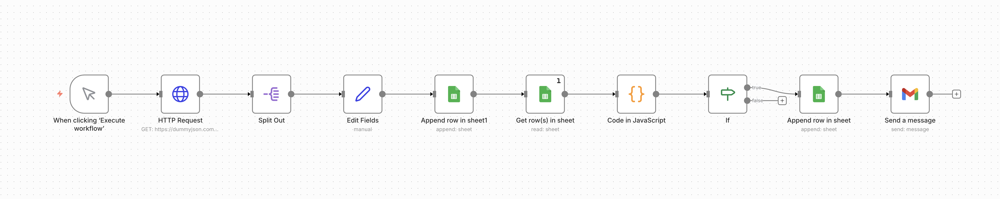
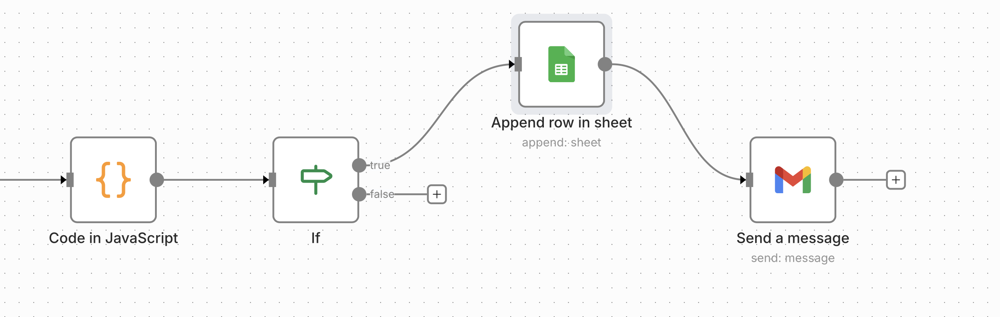

# 🛒 E-commerce Price Drop Alert System

An automation project that tracks e-commerce product prices, detects real price drops, and sends email alerts automatically.

---

## 📌 Overview
This project monitors product prices over time and notifies users **only when a price drop occurs**.

It demonstrates:
- Automation using n8n
- Historical data tracking
- Conditional logic
- SQL-style analytical thinking



---

## 🛠 Tech Stack
- n8n (Workflow Automation)
- Google Sheets (Price History Storage)
- JavaScript (Price Comparison Logic)
- SQL (Analytical Logic)
- Email (Alert Notifications)

---

## 🔄 n8n Workflow
The workflow fetches product data, stores price history, compares prices, and triggers alerts only on genuine price drops.



---

## 📊 Price History Storage
Google Sheets is used as a lightweight database to store historical prices for each product.


---

## 🧠 Price Drop Detection Logic
A price drop is detected using the condition:
current_price < previous_price
Only the **same product’s** latest and previous prices are compared.

---

## 🧮 SQL Equivalent Logic
The same price-drop logic can be implemented in SQL using window functions.

```sql
WITH price_history AS (
  SELECT
    id,
    title,
    price,
    fetched_at,
    LAG(price) OVER (PARTITION BY id ORDER BY fetched_at) AS previous_price
  FROM ecommerce_price_history
)
SELECT *
FROM price_history
WHERE price < previous_price;


## Issues Faced & Fixes

### 1. Multiple rows added unintentionally
Cause: Append row placed before IF node.
Fix: Append only after filtering logic.

### 2. Price treated as string
Cause: Google Sheets stores values as text.
Fix: Converted price to Number in JS.

### 3. Multiple items passing IF condition
Cause: IF checked absolute price (<10) instead of price drop.
Fix: Compared previous_price vs current_price.

### 4. Wrong previous_price selected
Cause: Rows not sorted by fetched_at.
Fix: Sorted rows in descending order before comparison.

### 5. False branch confusion
Fix: Left false branch empty intentionally.
